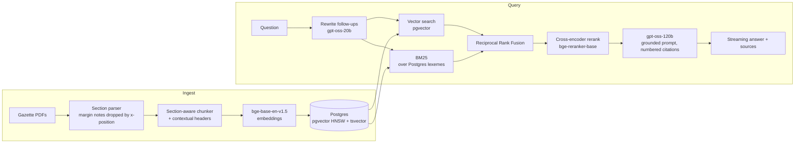

# Nyaya — a RAG assistant for Indian law, with measured retrieval quality

Ask plain-English questions about three Indian Acts and get answers that cite the exact section:

- **Digital Personal Data Protection Act, 2023** (44 sections + penalty Schedule)
- **Right to Information Act, 2005** (31 sections + 2 Schedules, consolidated to 2021)
- **Consumer Protection Act, 2019** (107 sections)

Every answer is grounded in the official statute text, cites its sources inline (`[1]`, `[2]`), and refuses
questions the Acts don't cover. A hand-labelled eval set measures how well each retrieval strategy finds the
right section, and an LLM judge grades whether answers are faithful to the retrieved text.

**Stack:** Next.js 16 · FastAPI · Postgres 17 + pgvector · BM25 · bge embeddings · bge cross-encoder reranker · Groq (gpt-oss-120b; Qwen3 judge)

---

## Results

<!-- RESULTS:START -->
**Retrieval: 78 answerable questions, section-level** (`backend/eval/results/retrieval.md`)

| Mode | Recall@1 | Recall@5 | Recall@10 | MRR@10 | Recall@5 (held-out) | p50 latency (CPU) |
|---|---|---|---|---|---|---|
| Postgres FTS (`ts_rank_cd`) | 23.7% | 66.0% | 84.6% | 0.442 | 62.8% | 1 ms |
| BM25 | 49.4% | 85.3% | 89.7% | 0.673 | 87.2% | 1 ms |
| Vector (bge-base, pgvector HNSW) | 67.3% | 94.2% | 97.4% | 0.798 | 93.6% | 16 ms |
| Hybrid (RRF) | 69.9% | 91.7% | 96.2% | 0.812 | 91.0% | 19 ms |
| **Hybrid + cross-encoder rerank** | 69.2% | **95.5%** | **98.1%** | 0.813 | 93.6% | 1.5 s |

What the numbers say:

- **BM25 instead of Postgres FTS ranking: Recall@5 66.0% → 85.3%**, and 47.4% → 76.3% on paraphrased questions. `ts_rank_cd` has no IDF.
- **Vector search is a strong baseline here.** Naive RRF with BM25 *lowered* Recall@5 (94.2% → 91.7%) because BM25 pulls in keyword-matching but off-topic sections on lay-language questions.
- **The reranker alone made things worse** (89.1% R@5): bge-reranker-base overrode correct vector+BM25 agreement, e.g. it dropped s.7 "legitimate uses" for *"Can my employer use my data without asking?"*. `eval/rerank_experiment.py` compared 3 rerankers × 2 candidate depths × 2 fusion strategies, **choosing on odd-numbered questions only**. The winner fuses the cross-encoder rank with the hybrid rank (RRF), so the reranker can promote a passage but can't single-handedly bury one. Result: best overall Recall@5/@10 and 100% on keyword questions.
- **Honest caveat:** on the held-out even-numbered half, the full pipeline *ties* vector-only (93.6%) and costs ~1.5 s on CPU. `ms-marco-MiniLM-L-12-v2` scores the same on held-out at ~1 s (`RERANK_MODEL=Xenova/ms-marco-MiniLM-L-12-v2`). With 78 questions, differences of one or two questions are within noise. The next step is a larger eval set.

**Answers: 83 questions, gpt-oss-120b answering, Qwen3-27B judging** (a different model family, to limit self-preference)

| Metric | Result |
|---|---|
| Faithfulness (claims supported by retrieved text) | **98.2%** (94.7% of answers fully faithful) |
| Correctness vs reference answer (1 / 0.5 / 0) | **85.9%** |
| Answers citing a gold section | 96.1% |
| Citations that point to a real source | 100% |
| Out-of-scope questions correctly refused | **100%** (5/5) |
| In-scope questions answered (not wrongly refused) | 97.4% |

These numbers use the original context strategy (top-5 chunks). Error analysis showed most incorrect answers had **the right section but the wrong chunk of it**. For example, *"Can my employer use my data?"* retrieved the start of s.7 but not clause (i), which covers employment, so the model faithfully answered "no".

**Fix: small-to-big context.** Search over chunks, then give the LLM the *whole section* (or the matched chunks plus their neighbours for very long sections), taking the top 5 distinct sections from the 15 best chunks (`section_context` in `app/retrieval.py`). On the first 22 questions, compared like-for-like with the same judge:

| Context | Correctness | Faithfulness | Gold citation | p50 latency |
|---|---|---|---|---|
| Top-5 chunks | 90.9% | 98.2% | 90.9% | 7.2 s |
| Whole sections | **95.5%** | 97.7% | **95.5%** | **3.8 s** |

The full 83-question re-run stopped at Groq's free-tier daily token limit. `make eval-answers` resumes it and updates the `/eval` page. Until it completes, 22 questions is a small sample (+2 fixed, −1 regressed), so treat this as directional.
<!-- RESULTS:END -->

---

## Architecture



### Design decisions

| Decision | Why |
|---|---|
| **Parse by section, not by page.** Sections are found by looking for the *next expected* section number at line start. | Lawyers cite sections; a section is the natural retrieval and evaluation unit. Expecting `n+1` also skips footnotes ("1. Subs. by Act 24 of 2019…") and numbered lists. |
| **Drop gazette margin notes by x-coordinate** (pypdf text-matrix positions). | Gazette PDFs print section titles in the page margins, and text extraction mixes them into the body. Title-matching heuristics deleted real words like "Act;". Filtering by position is exact. |
| **Contextual chunk headers** (`DPDP Act, 2023 — Section 8: General obligations of Data Fiduciary`) embedded and indexed with each chunk. | A chunk from deep inside s.8 still carries which Act and section it belongs to, which helps both retrievers and lets the LLM cite precisely. |
| **Real BM25 instead of `ts_rank_cd`.** | Postgres FTS ranking has no IDF, so matching "act" or "section" counts as much as matching "adulterant". BM25 reuses the `tsvector` lexemes, so stemming and stopwords stay consistent with Postgres. |
| **Hybrid via RRF, then a cross-encoder fused with the hybrid rank.** | RRF needs no score calibration between retrievers. Reranker-only ordering lost recall in testing; fusing its rank with the hybrid rank kept the gains without the regressions (see `eval/results/rerank_experiment.md`). |
| **Section-level metrics.** | Two chunks of the same section shouldn't count twice, and "did we find s.7 of the RTI Act" is what matters to a user. |
| **Exact refusal string** in the system prompt. | Lets the eval score refusals deterministically instead of asking a judge. |
| **Hand-transcribed Schedules.** | The DPDP penalty table extracts as scrambled columns, and the RTI Second Schedule is full of OCR'd footnote markers. Both answer common questions ("max fine for a breach?", "does RTI cover the CBI?"). |

---

## Evaluation methodology

`backend/eval/dataset.jsonl` has 83 questions written against the statute text:

| Type | n | Example |
|---|---|---|
| paraphrase | 38 | "If I agreed to let an app use my data, can I take that permission back later?" (no statutory vocabulary) |
| direct | 25 | "What qualities must valid consent have under the DPDP Act?" |
| keyword | 10 | "Which section of the IT Act was omitted by the DPDP Act?" |
| multi | 5 | "Does the RTI Act apply to the CBI?" → s.24 **and** the Second Schedule |
| unanswerable | 5 | "What is the punishment for cheque bounce?" (not in the corpus) |

Each answerable question lists its **gold section(s)** and a **reference answer** checked against the text.

- **Retrieval** (`eval/retrieval_eval.py`): Recall@1/3/5/10, Hit@k, MRR@10 and latency for all five modes, broken down by question type.
- **Answers** (`eval/answer_eval.py`): RAGAS-style **faithfulness** (the judge splits the answer into claims and checks each against the retrieved sources only), **correctness** against the reference (1 / 0.5 / 0), **citation validity**, **gold-citation rate**, and **refusal rate** on out-of-scope questions. Results are written after every question, so a run can resume after a rate-limit stop.

Limitations worth knowing: the eval set is small and was written by one person who could see the corpus; the judge is an LLM and is not human-validated; CPA pecuniary limits are as enacted (later notifications revised them by rule, and those rules aren't in the corpus).

---

## Running it

Prereqs: Python 3.11+ with [uv](https://docs.astral.sh/uv/), Node 20+, and either Docker or Homebrew Postgres 17 + pgvector.

```bash
cp backend/.env.example backend/.env        # add GROQ_API_KEY (free at console.groq.com)
cp frontend/.env.example frontend/.env.local

make db          # or: make db-local  (no Docker; brew install postgresql@17 pgvector)
make ingest      # parse PDFs -> chunk -> embed -> load (first run downloads ~1.3 GB of ONNX models)
make api         # http://localhost:8000
make web         # http://localhost:3000
```

Evaluate:

```bash
make eval-retrieval   # no API key needed
make eval-answers     # needs GROQ_API_KEY; resumable (free tier: ~200k judge tokens/day ≈ 60 questions)
```

### API

| Endpoint | |
|---|---|
| `POST /api/chat` | `{question, history?, mode?}` → SSE stream: `sources`, `token`…, `done` (timings), `error` |
| `POST /api/search` | `{query, mode?, top_k?}` → ranked chunks with per-retriever ranks and timings |
| `GET /api/sections/{id}` | full text of a section, e.g. `dpdp-8`, `rti-second-schedule` |
| `GET /api/meta` | corpus stats, model names, latest eval summary |

`mode` is one of `hybrid_rerank` (default), `hybrid`, `vector`, `bm25`, `fts`.

---

## Project layout

```
backend/
  app/          FastAPI app, retrieval (vector, BM25, RRF, rerank), Groq client
  ingest/       PDF -> sections (parse.py), chunking, loading; curated titles and schedules
  eval/         dataset.jsonl, retrieval_eval.py, answer_eval.py, results/
  sql/          schema (pgvector HNSW + generated tsvector)
  data/raw/     source PDFs (India Code / Gazette of India)
frontend/       Next.js chat UI with citation chips, a sources inspector and an /eval page
```

Sources: [India Code](https://www.indiacode.nic.in) and the Gazette of India. This project gives legal
information, not legal advice.
